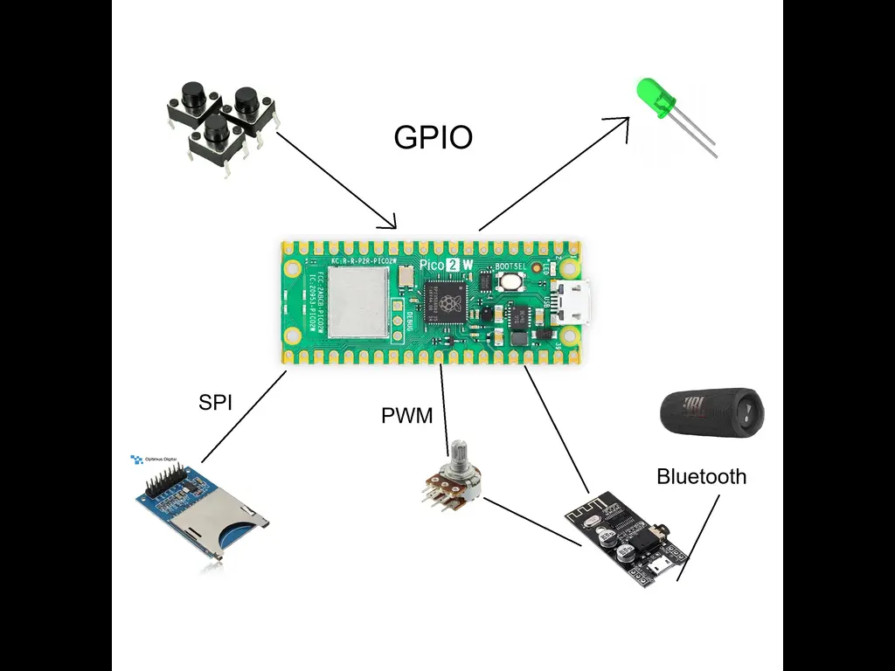
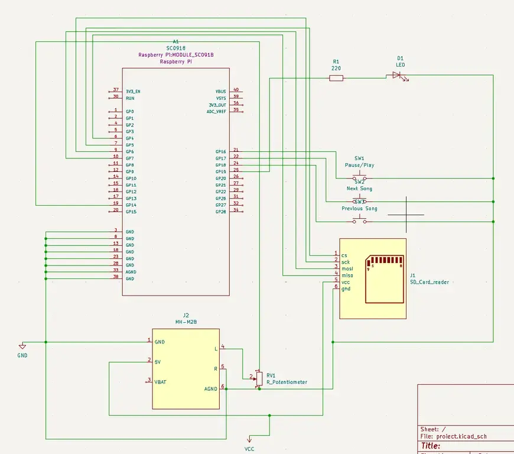

# mp3 player
A bluetooth mp3 player

:::info 

**Author**: Cihodaru Valentin-Alexandru \
**GitHub Project Link**: https://github.com/UPB-PMRust-Students/project-Vulisu

:::

## Description

An mp3/wav player that reads the song from a sd card and plays it on a bluetooth speaker. The mp3 
player also has a potentiometer that is used to change the volume, a play/pause button and skip 
song and backwards buttons. 
## Motivation

I chose this project because I think an mp3 bluetooth player that has the songs stored offline can be helpful when there is no internet access.
## Architecture 



## Log

<!-- write your progress here every week -->

### Week 5 - 11 May

### Week 12 - 18 May

### Week 19 - 25 May

## Hardware

Detail in a few words the hardware used.

### Schematics



### Bill of Materials

<!-- Fill out this table with all the hardware components that you might need.

The format is 
```
| [Device](link://to/device) | This is used ... | [price](link://to/store) |

```

-->

| Device | Usage | Price |
|--------|--------|-------|
| [Raspberry Pi Pico W](https://www.raspberrypi.com/documentation/microcontrollers/raspberry-pi-pico.html) | The microcontroller | [35 RON](https://www.optimusdigital.ro/en/raspberry-pi-boards/12394-raspberry-pi-pico-w.html) |


## Software

| Library | Description | Usage |
|---------|-------------|-------|
| [embassy-rs](https://github.com/embassy-rs/embassy) | Embassy-rs | Async GPIO, PWM, PIO, and ADC |
| [Synphonia](https://github.com/pdeljanov/Symphonia) | Audio decoding | Decode the mp3 to be able to be played |

## Links

<!-- Add a few links that inspired you and that you think you will use for your project -->

1. [link](https://example.com)
2. [link](https://example3.com)
...
